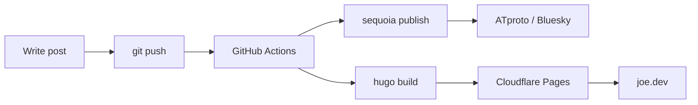

+++
date = '2026-05-21T13:05:12-07:00'
draft = false
title = 'Hello, World'
description = 'First post — testing the pipeline.'
tags = ['meta']
atUri = "at://did:plc:vkn2vmcnsmlffrpwalvgybw5/site.standard.document/3mmff6f5q5w2u"
coverImage = "static/covers/hello-world.png"

[cover]
  image = "/covers/hello-world.png"
  alt = "Hello, World — First post — testing the pipeline."
  hidden = true
+++

Well, here we are.

This is the first post on the new [joe.dev](https://joe.dev) — a fresh Hugo setup deploying via Cloudflare Pages, with posts mirrored to ATproto via [Sequoia](https://sequoia.pub).

Nothing deep to say yet. Just kicking the tires and making sure the whole pipeline works end to end. More soon.

## Code highlighting

Here's some Go:

```go
package main

import (
	"context"
	"fmt"
	"log"

	"github.com/stacklok/mcp-go/pkg/server"
)

func main() {
	srv := server.New("example", "0.1.0")
	srv.AddTool("greet", func(ctx context.Context, name string) (string, error) {
		return fmt.Sprintf("Hello, %s!", name), nil
	})
	if err := srv.Run(context.Background()); err != nil {
		log.Fatal(err)
	}
}
```

And some Bash:

```bash
#!/usr/bin/env bash
set -euo pipefail

REPO="jbeda/joe-dev-blog"

# Trigger a manual deploy
gh workflow run deploy.yml --repo "$REPO"

# Watch the run
gh run watch --repo "$REPO" \
  "$(gh run list --repo "$REPO" --limit 1 --json databaseId -q '.[0].databaseId')"
```

## Diagram

And a Mermaid diagram:


